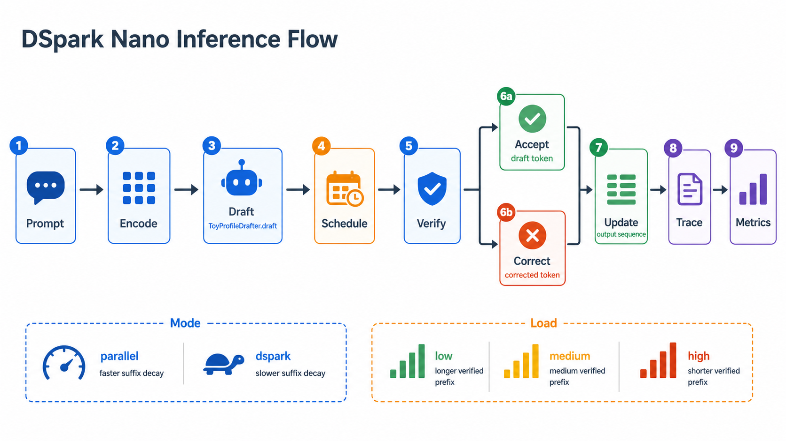
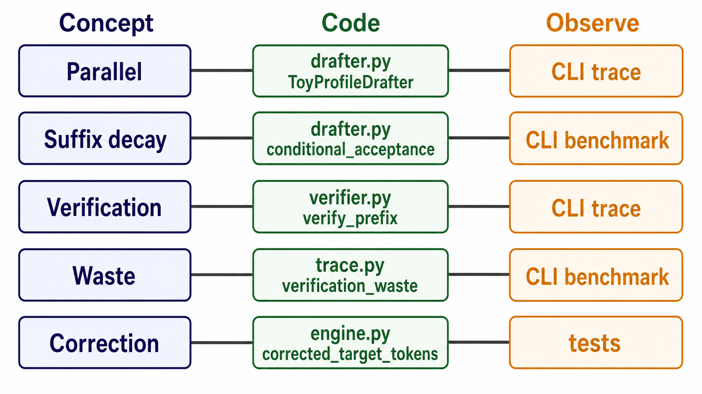

# DSpark Nano

DSpark Nano 是一个极小、可读、可跑的推理教学库，用来解释 DSpark 风格推测解码（speculative decoding）里的几个核心概念：草稿生成、前缀校验、错位修正、置信度调度和验证浪费。

它不是 DeepSeek 官方项目，不复用 [DeepSpec](https://github.com/deepseek-ai/DeepSpec) 代码，不复现 DeepSeek-V4 serving，也不声称达到论文中的线上吞吐或速度结论。这个仓库的目标是把复杂机制压缩成一段能读懂、能运行、能截图讲解的最小实验。

## 一句话解释 DSpark

DSpark 要解决的不是“让模型多线程吐字”，而是：一次猜多个 token 时，后缀越往后越容易错；目标模型验证又很贵，所以需要同时提升草稿后缀质量，并用置信度决定这一轮到底验证多少 token。

## 我们实现的核心能力

| 能力 | 你能看到什么 |
| --- | --- |
| 两种草稿模式 | `parallel` 模拟后缀快速衰减，`dspark` 模拟更稳定的 DSpark 风格后缀。 |
| 置信度调度 | `scheduler.py` 按存活概率和负载 profile 决定验证几个候选 token。 |
| 最长前缀校验 | `verifier.py` 只接受从第一个位置开始连续命中的 draft token。 |
| 错位修正 | 草稿一旦猜错，`engine.py` 会追加目标模型给出的 corrected token。 |
| 可读 trace | `trace` 命令输出每个位置的 draft、target、confidence、survival 和 status。 |
| 小型对比实验 | `benchmark` 命令对比 `parallel` / `dspark` 的 rounds、verified、waste 等指标。 |
| 图文素材源 | Mermaid 源文件和 ImageGen 视觉图一起保留，方便后续文章、卡片和视频复用。 |



图示结构源文件：[assets/dspark-nano-flow.mmd](assets/dspark-nano-flow.mmd)。

## 这个库能帮你什么

如果你对大模型推理（LLM Inference）或 AI 基础设施（AI Infra）感兴趣，DSpark Nano 适合用来做三件事：

- 用几十行核心流程看清推测解码为什么需要草稿器（drafter）、目标模型（target model）、校验器（verifier）和调度器（scheduler）。
- 把论文里的抽象词变成可运行执行追踪（trace）：每一轮草稿猜了什么、校验了多少、哪里被修正、哪里浪费了验证成本。
- 为内容生产准备稳定素材：输出是确定性的，不依赖 GPU、大模型权重或线上推理服务（serving）环境，适合录屏、截图和逐步讲解。

它不适合用来评测真实模型吞吐，也不适合作为生产推理引擎。

## 快速开始

从仓库根目录运行：

```bash
uv run python -m dspark_nano.cli trace
uv run python -m dspark_nano.cli benchmark
uv run pytest
```

如果本机还没有 `uv`，先按 uv 官方文档安装，并确保 `uv` 在 `PATH` 里。本仓库的 README 不绑定任何本机绝对路径。

也可以运行示例模块：

```bash
uv run python -m examples.toy_trace
uv run python -m examples.benchmark_toy
```

## 先看一个输出

教学用小型对比实验（toy benchmark）会输出类似结果：

```text
mode     rounds  tokens  draft  corrected  verified  waste
-------- ------- ------- ------ ---------- --------- ------
parallel       8      24     16          8        24      8
dspark         6      24     18          6        24      6
```

这只说明教学 profile 下的机制差异，不是 DeepSpec 或 DeepSeek-V4 的实测结果。

## 模式：parallel 和 dspark

本仓库的 `mode` 指的是教学用草稿器 profile，也就是“草稿器如何制造候选 token 和置信度曲线”。它不是完整推理服务系统里的部署模式。

| 模式 | 它在这里模拟什么 | 你应该怎么看 |
| --- | --- | --- |
| `parallel` | 一次并行猜出多个候选 token，但越靠后的 token 越容易错。 | 用来展示传统并行草稿的后缀衰减（suffix decay）：后缀位置看起来省时间，但命中率下降会制造验证浪费。 |
| `dspark` | 用更稳定的 DSpark 风格 profile 模拟半自回归草稿，后缀置信度下降更慢。 | 用来观察同样的校验器和调度器下，后缀更稳会怎样减少轮数和 waste。 |

这里没有单独的 `dispatch` mode。如果你说的 Dispatch 是推理系统里的“请求派发、批次派发或执行派发”，那属于推理服务调度器（serving scheduler）或运行时（runtime）层的问题；DSpark Nano 当前只把它简化成 `scheduler.py` 里的负载感知前缀调度。换句话说：

- `parallel` / `dspark`：草稿器侧的候选质量差异。
- dispatch：系统侧把请求、批次或验证任务派到哪里执行。

后续如果要专门讲 serving dispatch，应该在 scheduler/runtime 层新增实验，而不是把它混进 drafter mode。

## 术语表

| 术语 | 在 DSpark Nano 里代表什么 |
| --- | --- |
| Draft | 草稿器一次猜出的候选 token。它还没有被目标模型承认，只是“候选答案”。 |
| Verified | 被目标模型实际校验过的候选 token 数。Verified 不等于最终输出 token，因为校验过的 token 也可能在不匹配（mismatch）后变成 waste。 |
| Corrected | 草稿 token 在某个位置猜错后，由目标模型追加的正确 token。它保证生成可以继续前进。 |
| Waste | 已经花了验证成本，但最终没有被接受的候选 token。代码里是 `scheduled_length - accepted_length`。 |
| Accepted | 已被目标模型接受、可以进入输出序列的草稿 token。 |
| Pruned | 调度器因置信度或存活概率太低而没有送去验证的候选 token。 |

执行追踪里的 `corrected` 是一个位置状态，小型对比实验里的 `corrected` 是累计数量；两者含义一致，都是目标模型补上的正确 token。

## Python API

```python
from dspark_nano import DSparkNano, DSparkNanoConfig, SamplingConfig

engine = DSparkNano(DSparkNanoConfig(gamma=5, drafter_mode="dspark"))
result = engine.generate("dspark", SamplingConfig(max_tokens=12, load="medium"))

print(result.text)
print(result.metrics)
print(result.traces[0].table())
```

## Trace 示例

```text
pos | draft | target | conf | survival | status
----|-------|--------|------|----------|--------
  0 |     1 |      1 | 0.93 |   0.9300 | accepted
  1 |    20 |     20 | 0.84 |   0.7812 | accepted
  2 |    34 |     34 | 0.76 |   0.5937 | accepted
  3 |    88 |     87 | 0.68 |   0.4037 | corrected
  4 |    89 |     88 | 0.61 |   0.2463 | pruned_by_confidence
```

这张表可以按下面的方式读：

- `draft` 是候选 token。
- `target` 是教学用目标模型在同一位置给出的正确 token。
- `conf` 是教学用草稿器给这个位置的置信度。
- `survival` 是从第一个候选一路接受到当前位置的近似存活概率（survival probability）。
- `status` 描述这个位置最后被接受、修正、剪枝还是没有进入验证。

## 代码地图



图示结构源文件：[assets/dspark-code-comparison.mmd](assets/dspark-code-comparison.mmd)。

| 文件 | 职责 |
| --- | --- |
| `target.py` | 确定性的教学目标 token 序列。 |
| `drafter.py` | 读取目标 token 的手写 profile；展示 `parallel` / `dspark` 两种后缀衰减曲线。 |
| `scheduler.py` | 负载感知教学调度器；不等价于官方 DeepSpec 评估或 DeepSeek-V4 生产调度器。 |
| `verifier.py` | 推测解码的最长前缀接受规则。 |
| `trace.py` | 单轮执行追踪、token 表格和调试数据。 |
| `engine.py` | `generate` 与 `step_trace` 主循环。 |
| `benchmark.py` | `parallel` / `dspark` 教学对比实验。 |
| `cli.py` | `trace` 与 `benchmark` 命令行入口。 |

## 测试

```bash
uv run pytest tests/test_dspark_nano.py
```

当前测试覆盖：

- 局部不匹配会追加目标模型的修正 token；
- `scheduled_length == 0` fallback 会计入一次目标模型前进一步的成本；
- load profile 的验证长度单调；
- scheduler stop reason 和 per-token rows；
- trace / generate / benchmark 的核心行为。

## 边界

`ToyProfileDrafter` 会读取教学目标 token，再按手写接受率 profile 制造命中或不匹配。这样做是为了让后缀衰减和修正过程可解释、可截图；它不是真实草稿模型。

后续如果要更接近 DeepSpec，可以继续做两类迭代：

- 用无目标泄漏的 toy logits / transition model 替换 oracle toy profile。
- 把 scheduler 拆成更接近 serving 的 batching、dispatch 和 verification pipeline。
